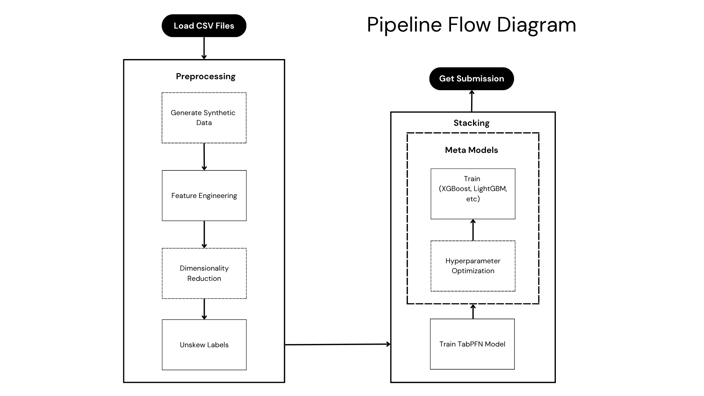

# Multi-Target Blend Property Prediction Pipeline

A comprehensive machine learning pipeline for predicting 10 blend properties (`BlendProperty1` through `BlendProperty10`) using various advanced modeling approaches including TabPFN, Gradient Boosting, Deep Learning, and AutoML techniques.

🏆 Hackathon Achievement
This project was developed for the Shell.AI Hackathon and achieved 44th nationally. The solution demonstrates a robust approach to multi-target regression problems using ensemble methods and advanced ML techniques.

## 🎯 Overview

This project implements multiple machine learning pipelines to predict blend properties from component compositions and their individual properties. The system supports:

- **Multi-target regression** for 10 blend properties
- **Advanced feature engineering** with component fractions and weighted properties
- **Multiple modeling approaches** from traditional ML to deep learning
- **Automated hyperparameter optimization** using Optuna
- **Ensemble methods** and stacking approaches

## 🏗️ Pipeline Architecture

The system consists of several independent pipelines that can be run individually or in ensemble, below is one the pipeline's diagram:



## 🔧 Data Processing

### DataFrameLoader (`ingestion.py`)

The core data processing module handles:

- **Power Transformation**: Yeo-Johnson transformation for target variables
- **Synthetic Data Generation**: Using Gaussian Copula Synthesizer **(Optional)**
- **Dimensionality Reduction**: Kernel PCA for component properties  **(Optional)**
- **Feature Engineering**: Advanced blend-specific features  **(Optional)**
- **Robust Scaling**: Preprocessing for model stability

### Key Features Generated

- Fraction diversity (Shannon entropy)
- Dominant component identification
- Weighted property averages
- Component-specific contributions
- Statistical measures (std, range, CV)

## 🤖 Model Pipelines

| Pipeline | Model Type | Key Features | Hyperparameter Optimization | Multi-Output Approach | GPU Support |
|----------|------------|--------------|------------------------------|----------------------|-------------|
| **TabPFN Pipeline** | Prior-based Neural Network | Zero-shot learning, Quantile predictions | ❌ Pre-trained | Individual models | ✅ Auto |
| **TabPFN Stacking** | TabPFN + Meta-learner | Quantile features + Secondary model | ✅ Optuna | Individual models | ✅ Auto |
| **Gradient Boosting** | XGB/LightGBM/CatBoost | Tree-based, Feature importance | ✅ Optuna | Individual models | ✅ CUDA/OpenCL |
| **Deep GBM** | Neural Network on Tree Leaves | Embedding layers, Tree leaf indices | ❌ Fixed architecture | Multi-output | ✅ TensorFlow |
| **Ridge GBM** | Ridge on Tree Leaves | One-hot encoded leaves | ✅ Grid Search | Individual models | ❌ CPU only |
| **AutoGluon** | AutoML Ensemble | Multiple algorithms, Auto-tuning | ✅ Built-in | Individual/Multi/Ensemble | ✅ Auto |
| **Bayesian Ridge** | Bayesian Linear Model | Uncertainty quantification | ❌ Default params | Individual models | ❌ CPU only |

### Detailed Pipeline Descriptions

#### 1. TabPFN Pipeline (`tab_pipeline.py`)

- **Model**: Prior-based transformer for tabular data
- **Approach**: Individual models for each target
- **Features:**
  - Zero-shot learning (no hyperparameter tuning needed)
  - Multiple output types: mean, median, mode
  - Quantile predictions for uncertainty estimation
  - RegChain variant for sequential target prediction

#### 2. TabPFN Stacking Pipeline (`tab_gb_pipeline.py`)

- **Model**: TabPFN + Gradient Boosting meta-learner
- **Approach**: Two-stage learning
- **Features**:
  - Generates 12 quantile features per target (9 quantiles + mean/median/mode)
  - Meta-model selection based on validation performance
  - Supports XGBoost, LightGBM, CatBoost, HistGBM, RandomForest as meta-learners
  - Optional feature combination (original + quantile features)

#### 3. Gradient Boosting Pipeline (`gradient_boosting_pipeline.py`)

- **Models**: XGBoost, LightGBM, CatBoost
- **Approach**: Individual optimized models
- **Features**:
  - Extensive hyperparameter optimization with Optuna
  - GPU acceleration support
  - Cross-validation based optimization
  - Model-specific configurations

#### 4. Deep GBM Pipeline (`deepGBM.py`)

- **Architecture**: Neural Network with Embedding layers
- **Input**: Tree leaf indices from gradient boosting models
- **Features**:
  - Combines multiple gradient boosting models
  - Embedding-based representation of tree leaves
  - Multi-output regression head
  - Ridge regression variant for comparison

#### 5. AutoGluon Pipeline (`autogluon_pipeline.py`)

- **Framework**: Automated Machine Learning
- **Approaches:**
  - Individual models per target
  - Multi-output approach
  - Ensemble of different configurations
- **Features**:
  - Automatic model selection and hyperparameter tuning
  - Multiple preset configurations
  - Temporary directory management
  - Built-in validation and metrics

#### 6. Bayesian Ridge Pipeline (`bayesian_pipeline.py`)

- **Model**: Bayesian Ridge regression
- **Features**: Uses TabPFN-generated features as input
- **Approach**: Simple baseline with uncertainty quantification

## 🚀 Usage

### Basic Pipeline Execution

```python
# TabPFN Pipeline
from tab_pipeline import TabPFNPipeline
model = TabPFNPipeline(output_type='mean')
model.get_submission('submissions/tabpfn_predictions.csv')

# Gradient Boosting Pipeline
from gradient_boosting_pipeline import GradientBoostingPipeline
model = GradientBoostingPipeline(regressor=XGBRegressor, n_trials=50)
model.get_submission('submissions/xgb_predictions.csv')

# AutoGluon Pipeline
from autogluon_pipeline import AutoGluonPipeline
model = AutoGluonPipeline(approach='individual')
model.get_submission('submissions/autogluon_predictions.csv')
```

### Advanced Usage

```python
# TabPFN Stacking with custom meta-learner
from tab_gb_pipeline import TabPFNStackingPipeline
model = TabPFNStackingPipeline(
    meta_model=RandomForestRegressor,
    n_trials=30,
    combine_features=True
)
model.get_submission('submissions/tabpfn_stacking.csv')

# Deep GBM with multiple boosting models
from deepGBM import DeepGBM
model = DeepGBM(gradient_models=[XGBRegressor, LGBMRegressor])
model.train()
predictions = model.predict()
```

## 📊 Results

Each pipeline generates:

- **Validation metrics**: MAPE and R² scores for each target
- **Overall performance**: Average metrics across all targets
- **Submission files**: CSV files with predictions for test set
- **Model comparisons**: Performance comparisons between approaches

### Key Metrics Tracked

- **MAPE** (Mean Absolute Percentage Error)
- **R²** (Coefficient of determination)
- **Training time**
- **Memory usage** (for applicable models)

## 📁 File Structure

``` bash
├── ingestion.py             
├── tab_pipeline.py           
├── tab_gb_pipeline.py        
├── gradient_boosting_pipeline.py  
├── deepGBM.py               
├── autogluon_pipeline.py    
├── bayesian_pipeline.py 
├── pls_pipeline.py
├── quantile_pipeline.py
├── random_pipeline.py   
├── dataset/
│   ├── train.csv            
│   ├── test.csv  
│   └── sample_solution.csv           
├── submissions/             
├── models/                  
├── README.md
└── reqiurements.txt             
```

## 🛠️ Installation

### Requirements

```bash
pip install -r requirements.txt
```

### GPU Support (Optional)

For GPU acceleration:

- **CUDA**: For XGBoost, LightGBM, TensorFlow, TabPFN
- **OpenCL**: For LightGBM (alternative)
- **ROCm**: For supported AMD GPUs

## 🎯 Best Practices

1. **Pipeline Selection**:
   - Use TabPFN for quick, high-quality baselines
   - Use Gradient Boosting for interpretable, robust models
   - Use AutoGluon for automated model selection
   - Use Deep GBM for capturing complex patterns

2. **Hyperparameter Optimization**:
   - Start with fewer trials (10-20) for quick iterations
   - Increase trials (50-100) for final models
   - Use cross-validation for robust optimization

3. **Feature Engineering**:
   - Enable `add_features=True` for enhanced performance
   - Consider `reduce_dims=True` for high-dimensional data
   - Use synthetic data generation for small datasets

## 📈 Performance Tips

1. **GPU Utilization**: Enable GPU support for XGBoost, LightGBM, and TensorFlow models
2. **Memory Management**: Use data streaming for large datasets
3. **Parallel Processing**: Most pipelines support multi-core processing
4. **Caching**: Models and transformers are cached for efficiency
5. **Early Stopping**: Implemented in deep learning and some boosting models

---

**Note**: This pipeline system is designed for flexibility and extensibility. Each component can be used independently or combined for ensemble approaches.
